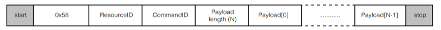
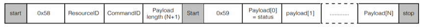

.. include:: ../../../substitutions.rst

##########################
Command Transport Protocol
##########################

*****************************************
Transport protocol for control parameters
*****************************************

Control parameters are converted to an array of bytes in network byte
order (big endian) before they’re sent over the transport protocol. For
example, to set a control parameter to integer value 305419896 which
corresponds to hex 0x12345678, the array of bytes sent over the
transport protocol would be {0x12, 0x34, 0x56, 0x78}. Similarly, a 4
byte payload {0x00, 0x01, 0x23, 0x22} read over the transport protocol
is interpreted as an integer value 0x00012322.

In addition to the control parameters values, commands include Resource
ID, the Command ID and Payload Length fields that must be communicated
from the host to the device. The Resource ID is an 8-bit identifier that
identifies the resource within the device that the command is for. The
Command ID is an 8-bit identifier used to identify a command for a
resource in the device. Payload length is the length of the data in
bytes that the host wants to write to the device or read from the
device.

The payload length is interpreted differently for GET\_ and SET\_
commands. For SET_commands, the payload length is simply the number of
bytes worth of control parameters to write to the device. For example,
the payload length for a SET\_ command to set a control parameter of
type int32 to a certain value, would be set to 4. For GET\_ commands the
payload length is 1 more than the number of bytes of control parameters
to read from the device. For example, a GET\_ command to read a
parameter of type int32, payload length would be set to 5. The one extra
byte is used for status and is the first byte (payload[0]) of the
payload received from the device. In the example above, payload[0] would
be the status byte and payload[1]..payload[4] would be the 4 bytes that
make up the value of the control parameter.

The table below lists the different values of the status byte and the
action the user is expected to take for each status:

.. list-table:: Values for returned status byte
  :widths: 15 15 70
  :header-rows: 1

  * - Return code
    - Values
    - Description
  * - ctrl_done
    - 0
    - Read command successful. The payload bytes contain valid payload returned from the device
  * - ctrl_wait
    - 1
    - Read command not serviced. Retry until ctrl_done status returned
  * - ctrl_invalid
    - 3
    - Error in read command. Abort and debug

The GET_commands need the extra status byte since the device might not
return the control parameter value immediately due to timing
constraints. If that is the case the status byte would indicate the
status as ctrl_wait and the user would need to retry the command. When
returned a ctrl_wait, the user is expected to retry the GET\_ command
until the status is returned as ctrl_done. The first GET_command is
placed in a queue and it will be serviced by the end of each 15ms audio
frame. Once the status byte indicates ctrl_done, the rest of the bytes
in the payload indicate the control parameter value.

******************************************
Transporting control parameters over |I2C|
******************************************

This section describes the |I2C| command sequence when issuing read and
write commands to the device.

The first byte sent over |I2C| after start contains the device address and
information about whether this is an |I2C| read transaction or a write
transaction. This byte is 0x58 for a write command or 0x59 for a read
command. These values are derived by left shifting the device address
(0x2c) by 1 and doing a logical OR of the resulting value with 0 for an
|I2C| write and 1 for an |I2C| read.

The bytes sequence sent between |I2C| start and stop for SET\_ commands is
shown in the figure below.

For GET\_ commands, the |I2C| commands sequence consists of a write
command followed by a read command with a repeated start between the 2
commands. The write command writes the resource ID, command ID and the
expected data length to the device and the read command reads the status
byte followed by the rest of the payload that makes up the control
parameter value. The figure below shows the |I2C| bytes sequence sent and
received for a GET\_ command.

****************************************
Transporting control parameters over USB
****************************************

Use the vendor_id 0x20B1, product_id 0x0020 and interface number 0 to
initialize for USB.

***************************************************
Floating point to fixed point (Q format) conversion
***************************************************

Numbers with fractional parts can be represented as floating-point or
fixed-point numbers. Floating point formats are widely used but carry
performance overheads. Fixed point formats can improve system efficiency
and are used extensively within the XVF3610. Fixed point numbers have
the position of the decimal point fixed and this is indicated as a part
of the format description.

In this document, Q format is used to describe fixed point number
formats, with the representation given as Q\ *m*.\ *n* format where *m*
is the number of bits reserved for the sign and integer part of the
number and *n* is the number of bits reserved for the fractional part of
the number. The position of the decimal point is a trade-off between the
range of values supported and the resolution provided by the fractional
bits.

The dynamic range of Q\ *m*.\ *n* format is -2\ :sup:`m-1` and
2\ :sup:`m-1`-2\ :sup:`-n` with a resolution of 2\ :sup:`-n`

To convert a floating-point format number to Q\ *m*.\ *n* format
fixed-point number:

-  Multiply the floating-point number by 2\ :sup:`m`

-  Round the result to the nearest integer

-  The resulting integer number is the Q\ *m*.\ *n* fixed-point
   representation of the initial floating-point number

To convert a Q\ *m*.\ *n* fixed-point number to floating-point:

-  Divide the fixed-point number by 2\ :sup:`m`

-  The resulting decimal number is a floating-point representation of
   the fixed-point number.

Converting a number into fixed point format and then back to a floating
point number may introduce an error of up to ±2\ :sup:`-(n+1)`

Example:

To represent a floating-point number 14.765467 in Q8.24 format, the
equivalent fixed-point number would be 14.765467 x 2\ :sup:`24` =
247723429.2 which rounds to 247723429.

To get back the floating-point number given the Q8.24 number 247723429,
calculate 247723429 ÷ 2\ :sup:`24` and get back the floating-point
number as 14.76546699. The difference of 0.00000001 is correct to with
the error bounds of ±2\ :sup:`-25` which is ±0.00000003