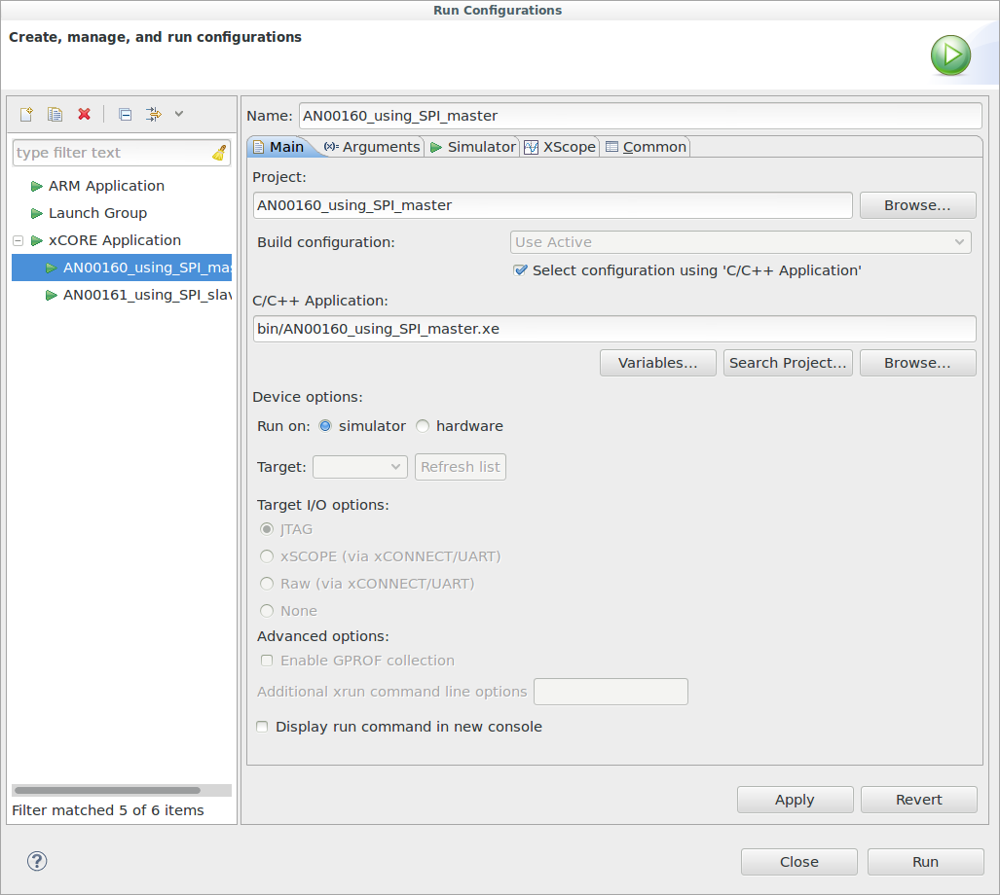
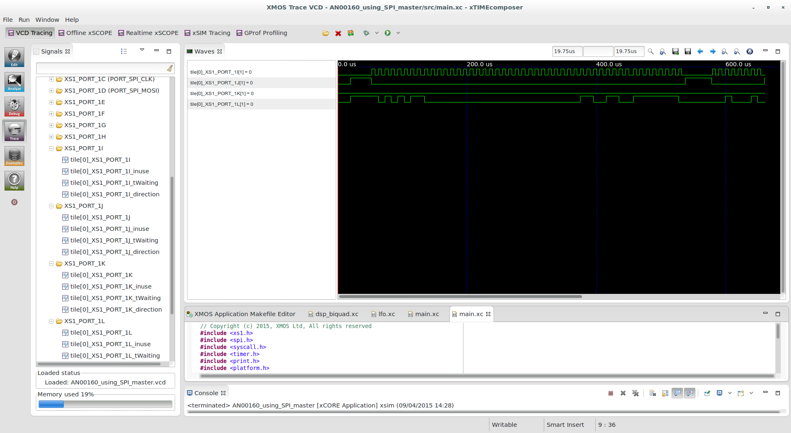

.. include:: ../../README.rst

|newpage|

Overview
--------

Introduction
............

The XMOS SPI library is a library that provides
software defined, industry-standard, SPI (serial peripheral interface)
components that allows you to control an SPI bus via the
xCORE GPIO hardware-response ports. SPI is a four-wire hardware
bi-directional serial interface.

The SPI bus can be used by multiple tasks within the xCORE device
and (each addressing the same or different slaves) and
is compatible with other slave devices on the same bus.

The library includes features such as SPI master and SPI slave modes,
supported speeds of up to 100 Mbit, multiple slave device support and
support for all configurations of clock polarity and phase.

Block diagram
.............

.. figure:: images/block_diagram.*
   :scale: 100%
   :align: center

   Block diagram of SPI master application example

SPI master example
------------------

The example in this application note uses the XMOS SPI library to
perform some bus transactions as SPI master. The binary is then run in
simulation so the user can see the waveform output in the VCD tracing
perspective in the xTIMEcomposer.

The application consists of two tasks:

   - A task that drives the SPI bus

   - An application task that connects to the SPI task

These tasks communicate via the use of xC interfaces.

The following diagram shows the task and communication structure of
the application.

.. figure:: images/task_diag.*

        Task diagram of SPI master example

Makefile additions for this example
...................................

To start using the SPI library, you need to add ``lib_spi`` to your ``Makefile``::

        USED_MODULES = ... lib_spi

You can then access the SPI functions in your source code via the
spi.h header file::

        #include <spi.h>

Declaring ports
...............

The SPI library connects to external pins via xCORE ports. In
``main.xc`` these are declared as variables of type ``port`` at the
start of the file:

.. literalinclude:: main.xc
   :start-on: p_sclk
   :end-on: p_mosi

Note that the slave select declaration (``p_ss``) is an array of
ports. This is what the SPI library expects since there may be many
slave select lines for multiple devices.

How the ports (e.g. ``XS1_PORT_1I``) relate to external pins will
depend on the exact device being used. See the device datasheet for details.

|newpage|

The application main() function
...............................

Below is the source code for the main function of this application,
which is taken from the source file ``main.xc``

.. literalinclude:: main.xc
   :start-on: int main
   :end-before: Uncomment

Looking at this in more detail you can see the following:

  - The par functionality describes running two separate tasks in parallel

  - The ``spi_master`` task drives the SPI bus and takes the ports it
    will use as arguments.

  - The ``app`` task communicates to the ``spi_master`` task via the
    shared interface argument ``i_spi``. This is an array since the
    SPI master task could connect to many other tasks in parallel.

The app() function
..................

The ``app`` function uses its interface connection to the SPI master
task to perform SPI transactions. It performs two transactions (each
transaction will assert the slave select line, transfer some data and then
de-assert the slave select line). The functions in the SPI master
interface can be found in the SPI library user guide.

.. literalinclude:: main.xc
   :start-on: void app
   :end-before: This application function

Note that when ``begin_transaction`` is called the device is selected
by the first argument. In this case it is ``0``, so the zero-th
element of the ``p_ss`` array will be used for the slave select
line. This is the method that is used to communiate with multiple SPI
slave devices. The speed and mode of the SPI protocol is also set at
in the ``begin_transaction`` call.

|newpage|

Setting up the run configuration for the application
....................................................

To run the application binary in the simulator, first the application
must be built by pressing the :menuitem:`Build` button in the
xTIMEcomposer. This will create the ``AN00160_using_SPI_master.xe``
binary in the ``bin`` folder of the project. The xTIMEcomposer may
have to import the SPI library if you do not already have it in your
workspace; this will occur automatically on build.

Then a *Run Configuration* needs to be set up. This can be done by
selecting the :menuitem:`Run,Run Configurations..` menu. You can
create a new run configuration by right clicking on the
:menuitem:`xCORE application` group in the left hand pane and
:menuitem:`new`. However, in this example a run configuration has
already been created for you.

Looking at this run configuration, you can see the simulator has been
selected under :menuitem:`Device Options:`:

|newpage|

In the :menuitem:`Simulator` tab of the run configuration. The
:menuitem:`Enable signal tracing` check box has been enabled and a
:menuitem:`Tile Trace Option` has been added to trace the ports on
tile[0]:

.. image:: images/run_config_trace.png
   :width: 70%
   :align: center

|newpage|

Running the application
.......................

By clicking on the :menuitem:`Run` icon (a green arrow) in the Edit
Perspective of the xTIMEcomposer or by clicking the :menuitem:`Run`
button in the run configuration dialog, the program
will run. In the console window you will get this output::

  Sending SPI traffic
  Done.

After this it will immediately swith the the VCD tracing perspective
(since signal tracing was enabled in the run configuration). In this
perspective you can drag ports from within the tree in the
:menuitem:`Signals` pane on the left hand side to the
:menuitem:`Waves` pane on the right:

.. image:: images/vcd1.png
   :width: 70%
   :align: center

By dragging in the four ports used by the application (1I, 1J, 1K and
1L) you can see that the application has driven the correct SPI
signal. Note that you need to expand each port and drag in just the
port value, the other traces (such as ``tile[0]_XS1_PORT_1J_inuse``)
just show the internal port state and are not so interesting here.

|newpage|

Using the asynchronous interface
................................

There is an alternative ``main()`` function in the program to try:

.. literalinclude:: main.xc
   :start-on: Uncomment

By uncommenting this main (and commenting out the original main) the
application will use the ``spi_master_async`` task instead of the
synchronous ``spi_master`` task. This task still drives the SPI bus
but runs on a separate logical core and will drive the bus in parallel
to your application. This way your application can overlap processing
with communication.

The ``async_app()`` function performs the same function as the
``app()`` function using the asynchronous interface. The big
difference is that pointers have to be passed to the SPI task  that
point to the buffers to send from/receive into. These need to be
*movable* pointers (see the xC programing guide for more information)
that can be passed to another task:

.. literalinclude:: main.xc
  :start-on: async_app
  :end-on: outbuf

|newpage|

Once the pointers have been initialized they can be passed and later
retrieved from the SPI master task:

.. literalinclude:: main.xc
  :start-on: traffic (async)
  :end-on: end_transaction

|appendix|
|newpage|

References
----------
  
.. nopoints::

  * XMOS Tools User Guide

    http://www.xmos.com/published/xtimecomposer-user-guide

  * XMOS xCORE Programming Guide

    http://www.xmos.com/published/xmos-programming-guide
  
  * XMOS SPI Library

    http://www.xmos.com/support/libraries/lib_spi

|newpage|

Full source code listing
------------------------

.. literalinclude:: main.xc
  :largelisting:

|newpage|

