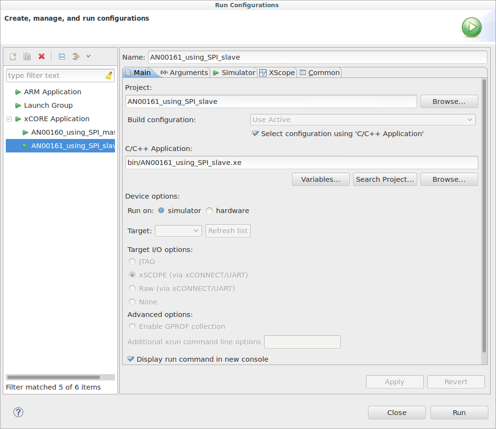
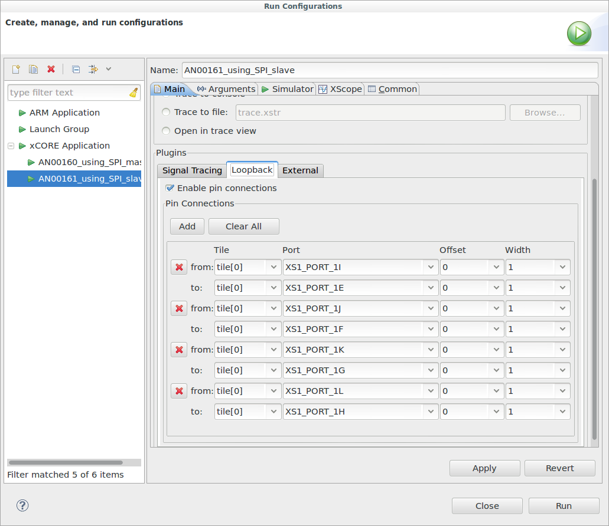

.. include:: ../../README.rst

|newpage|

Overview
--------

Introduction
............

The XMOS SPI library is a library that provides
software defined, industry-standard, SPI (serial peripheral interface)
components that allows you to control an SPI bus via the
xCORE GPIO hardware-response ports. SPI is a four-wire hardware
bi-directional serial interface.

The SPI bus can be used by multiple tasks within the xCORE device
and (each addressing the same or different slaves) and
is compatible with other slave devices on the same bus.

The library includes features such as SPI master and SPI slave modes,
supported speeds of up to 100 Mbit, multiple slave device support and
support for all configurations of clock polarity and phase.

Block diagram
.............

.. figure:: images/block_diagram.*
   :scale: 100%
   :align: center

   Block diagram of SPI slave application example

SPI slave example
------------------

The example in this application note uses the XMOS SPI library to
act as SPI slave. It maintains a register file which can be read and
written by the internal application *or* by the master on the SPI bus.
To show the bus functioning the demo application also has a tester
component connected to an SPI master bus which is connected (in
simulation) to the the SPI slave. This allows the generation of
traffic to show the the communication functioning.

The application consists of five tasks:

   - A task that controls the SPI slave ports

   - A task that implements the register file handling calls from the
     SPI slave component and the application

   - An application task that connects to the register file task

   - A task that controls the SPI master ports used for testing

   - A tester task that outputs commands to the SPI master task

These tasks communicate via the use of xC interfaces.

The following diagram shows the task and communication structure of
the application.

.. figure:: images/task_diag.*

        Task diagram of SPI slave example

The SPI slave task communicates via the ``spi_slave_callback_if``
which the SPI library defines as a set of callbacks a slave will make
to the application to handle communication occuring on the SPI
bus.

The application also needs to communicate with the register file task
to get or set register values. To do this we define a custom
communication software interface (``reg_if``).

|newpage|

Makefile additions for this example
...................................

To start using the SPI library, you need to add ``lib_spi`` to your ``Makefile``::

        USED_MODULES = ... lib_spi

You can then access the SPI functions in your source code via the
spi.h header file::

        #include <spi.h>

The example also uses the XMOS debug printing library
(``lib_logging``). This provides handy debug printing functions::

        USED_MODULES = ... lib_logging

Declaring ports
...............

The SPI library connects to external pins via xCORE ports. In
``main.xc`` these are declared as variables of type ``port`` at the
start of the file:

.. literalinclude:: main.xc
   :start-on: p_sclk
   :end-on: clock

Note that there is also a clock declaration since the slave needs to
use an internal clock as well as ports inside the xCORE device.

How the ports (e.g. ``XS1_PORT_1I``) relate to external pins will
depend on the exact device being used. See the device datasheet for details.

This application also has an SPI master interface on different ports:

.. literalinclude:: main.xc
   :start-on: p_test_sclk
   :end-on: p_test_mosi

|newpage|

The application main() function
...............................

Below is the source code for the main function of this application,
which is taken from the source file ``main.xc``

.. literalinclude:: main.xc
   :start-on: int main

Looking at this in a more detail you can see the following:

  - The par functionality describes running five separate tasks in
    parallel; three are for the main application and two are for the
    tester.

  - The ``spi_slave`` task controls the application
    SPI bus and takes the ports it will use as arguments.

  - The ``reg_file`` task is connected to the ``app`` task and the
    ``spi_slave`` task.

  - The ``spi_slave`` task has an argument for the mode is expects -
    in this case Mode 0 (see the SPI library user guide for more
    details on modes)

  - The ``spi_slave`` task also has an argument
    ``SPI_TRANSFER_SIZE_8`` which specifies the size of data chunk it
    will use when making callbacks to the application.

  - The ``spi_master`` task controls the test SPI bus and takes
    different ports to the SPI slave bus as arguments. For details on
    using SPI master see application note AN00160.

The reg_file() function
.......................

The ``reg_file`` function is the main logic of this example. It will
respond to calls from the application and the SPI slave bus whilst
maintaining a set of register values.

The function is marked as ``[[distributable]]`` which means it only
responds to calls from other tasks. The main reason for this is so
that the ``reg_file`` task itself does not need a logical core of its
own it can use the logical core of the task that calls it. See the
XMOS programming guide for details of distributable tasks.

The function takes two arguments, the interface connections to the
application task and the SPI slave task:

.. literalinclude:: main.xc
   :start-on: [[distributable]]
   :end-on: {

The ``reg_if`` interface has been defined in ``main.xc`` earlier. It
defines the functions that the app may call in the ``reg_file`` tasks:

.. literalinclude:: main.xc
   :start-on: interface
   :end-on: }

In this case we have two functions - one for reading a register value
and one for writing a register value.

The ``reg_file`` function first declares its state - an array to hold
register value, a state variable to hold what stage of an SPI
transaction it is in and the currently addressed register by the SPI bus.

.. literalinclude:: main.xc
   :start-on: This array holds
   :end-on: addr = 0

The state variable is just an integer from the following ``enum`` type
defined earlier in the file:

.. literalinclude:: main.xc
   :start-on: enum
   :end-on: }

The implemented protocol on the SPI bus is as follows:

  * The master will start a transaction (assert slave select)
  * It will then send a byte of either a 0 for a write or a
    1 for a read.
  * It will then send the address of the register to read/write
  * It will then send or receive the value of the register

|newpage|

To implement the protocol logic the ``reg_file`` tasks must continually react
to events from the SPI slave tasks keeping track of its state,
updating registers and supplying the correct outputs. This is done via
a ``while (1)`` loop with an xC ``select`` statement inside it. A
``select`` statement will wait and then react to various events or
calls from different tasks - see the XMOS programming guide for more details.

The following cases in the main loop of the function handle this:

.. literalinclude:: main.xc
   :start-on: while (1)
   :end-before: respond to the application

We can see that the slave will always send the value of the currently
addressed register on every data transfer (this is allowable in the
described protocol).

When the SPI master supplies some data to the slave then what happens
depends on the current state - either the state variable is updated,
the currently addressed register is updated or a register value is
updated. This state machine will implement the previously described
protocol.

|newpage|

The main select also needs to react to request from the
application. The following cases implement this:

.. literalinclude:: main.xc
   :start-on: respond to the application
   :end-before: }

The app() function
..................

The ``app`` task represents a sample application tasks that uses the
register file. In this demo, it doesn't do much - it simple sets one
register and repeatedly polls the value of another register and prints
out its value:

.. literalinclude:: main.xc
  :start-on: app(
  :end-before: tester

Note that the ``debug_printf`` function comes from the
``debug_print.h`` header supplied by ``lib_logging``. It is a low
memory debug printing function that will print out messages to the
console in the xTIMEcomposer (either using JTAG or xSCOPE to
communicate to the host via the debug adaptor).

The tester() function
.....................

The tester function will send some test data to the SPI master
bus. It does this using the SPI master interface to communicate with
the SPI master task:

.. literalinclude:: main.xc
  :start-on: tester(
  :end-before: main

|newpage|

Setting up the run configuration for the application
....................................................

To run the application binary in the simulator, first the application
must be built by pressing the :menuitem:`Build` button in the
xTIMEcomposer. This will create the ``AN00161_using_SPI_slave.xe``
binary in the ``bin`` folder of the project. The xTIMEcomposer may
have to import the SPI library if you do not already have it in your
workspace; this will occur automatically on build.

Then a *Run Configuration* needs to be set up. This can be done by
selecting the :menuitem:`Run,Run Configurations..` menu. You can
create a new run configuration by right clicking on the
:menuitem:`xCORE application` group in the left hand pane and
:menuitem:`new`. However, in this example a run configuration has
already been created for you.

Looking at this run configuration, you can see the simulator has been
selected under :menuitem:`Device Options:`:

|newpage|

In the :menuitem:`Loopback` tab of the :menuitem:`Simulator` tab of
the run configuration. The
:menuitem:`Enable pin connections` check box has been enabled and four
loopback connections have been added connecting the SPI master ports
to the corresponding SPI slave ports:

|newpage|

Running the application
.......................

By clicking on the :menuitem:`Run` icon (a green arrow) in the Edit
Perspective of the xTIMEcomposer or by clicking the :menuitem:`Run`
button in the run configuration dialog, the program
will run. In the console window you will get this output::

  APP: Set register 1 to 0xFE
  APP: Register 1 is 0x0
  APP: Register 1 is 0x0
  APP: Register 1 is 0x0
  APP: Register 1 is 0x0
  APP: Register 1 is 0x0
  APP: Register 1 is 0x0
  APP: Register 1 is 0x0
  APP: Register 1 is 0x0
  APP: Register 1 is 0x0
  SPI MASTER: Read register 0: 0xFE
  APP: Register 1 is 0x0
  APP: Register 1 is 0x0
  APP: Register 1 is 0x0
  APP: Register 1 is 0x0
  APP: Register 1 is 0x0
  APP: Register 1 is 0x0
  APP: Register 1 is 0x0
  APP: Register 1 is 0x0
  APP: Register 1 is 0x0
  SPI MASTER: Set register 1 to 0xAC
  APP: Register 1 is 0xAC
  APP: Register 1 is 0xAC
  APP: Register 1 is 0xAC
  ...

You can terminate the program by clicking the :menuitem:`Terminate`
button in the Console window (the red square).

The console shows the debug print output from the application and tester. You
can see that the SPI bus can read registers that the application has
set and the application can read registers that the SPI bus has set.

|appendix|
|newpage|

References
----------
  
.. nopoints::

  * XMOS Tools User Guide

    http://www.xmos.com/published/xtimecomposer-user-guide

  * XMOS xCORE Programming Guide

    http://www.xmos.com/published/xmos-programming-guide
  
  * XMOS SPI Library

    http://www.xmos.com/support/libraries/lib_spi

|newpage|

Full source code listing
------------------------

.. literalinclude:: main.xc
  :largelisting:

|newpage|

