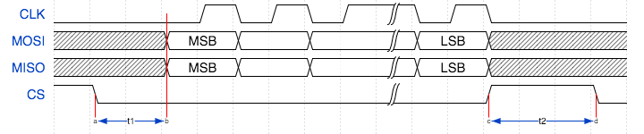
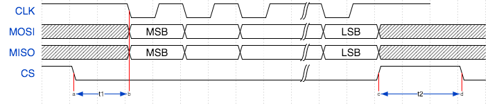

.. include:: ../../../README.rst

External signal description
---------------------------

The SPI protocol requires a clock, one or more slave selects
and either one or two data wires.

.. _spi_wire_table:

.. list-table:: SPI data wires
     :class: vertical-borders horizontal-borders

     * - *SCLK*
       - Clock line, driven by the master
     * - *MOSI*
       - Master Output, Slave Input data line, driven by the master
     * - *MISO*
       - Master Input, Slave Output data line, driven by the slave
     * - *SS*
       - Slave select line, driven by the master

During any transfer of data, the master will assert the *SS*
line and then output a series of transitions on the *SCLK*
wire. During this time, the slave will drive data to be sampled by the
master and the master will drive data to be sampled by the slave. At
the end of the transfer, the *SS* is de-asserted.

If the slave select line is not driven high then the slave should
ignore any transitions on the other lines.

SPI modes
.........

The data sample points for SPI are defined by the clock polarity (CPOL) and clock phase (CPHA)
parameters. SPI clock polarity may be inverted or non-inverted by the CPOL and the CPHA parameter
is used to shift the sampling phase. The following for sections illustrate the MISO and MOSI data lines
relative to the clock. The timings are given by:

.. list-table:: SPI timings
     :class: vertical-borders horizontal-borders

     * - *t1*
       - The minimum time from the start of the transaction to data being valid on the data pins.
     * - *t2*
       - The inter-transmission gap. This is the minimum amount of time that the slave select must be de-asserted.
     * - *MAX CLOCK RATE*
       - This is the maximum clock rate supported by the configuration.

The setup and hold timings are inherited from the underlying xCORE
device. For details on these timing please refer to the device datasheet.

Mode 0 - CPOL: 0 CPHA 1
~~~~~~~~~~~~~~~~~~~~~~~

   Mode 0

The master and slave will drive out their first data bit on the first rising edge of the clock and sample on the subsequent falling edge.

Mode 1 - CPOL: 0 CPHA 0
~~~~~~~~~~~~~~~~~~~~~~~

   Mode 1

The master and slave will drive out their first data bit before the first rising edge of the clock then drive on subsequent falling edges. They will sample on rising edges.

Mode 2 - CPOL: 1 CPHA 0
~~~~~~~~~~~~~~~~~~~~~~~

   Mode 2

The master and slave will drive out their first data bit before the first falling edge of the clock then drive on subsequent rising edges. They will sample on falling edges.

Mode 3 - CPOL: 1 CPHA 1
~~~~~~~~~~~~~~~~~~~~~~~

   Mode 3

The master and slave will drive out their first data bit on the first falling edge of the clock and sample on the subsequent rising edge.

SPI master timing characteristics
.................................

The application calls functions to begin a transaction (which asserts
the slave select line) and to transfer data. So the minimum time
between these (*t1*) can be controlled by the application.

The inter-transmission gap (*t2*) is also controlled by the user
application since the function to specify the end of the transaction
(i.e. the de-assertion of the slave select line) has an argument which
is the minimum amount of time before which another transaction can start.

Synchronous SPI master clock speeds
~~~~~~~~~~~~~~~~~~~~~~~~~~~~~~~~~~~

The maximum speed that the SPI bus can be driven depends on whether a
clock block is used, the speed of the logical core that the SPI code
is running on and where both the *MISO* and *MOSI* lines are used. The
timings can be seen in :ref:`spi_master_sync_timings`.

.. _spi_master_sync_timings:

.. list-table:: SPI master timings (synchronous)
 :header-rows: 1

 * - Clock blocks
   - MISO enabled
   - MOSI enabled
   - Max kbps (62.5 MHz core)
   - Max kbps (125 MHz core)
 * - 0
   - 1
   - 0
   - 2497
   - 3366
 * - 0
   - 1
   - 1
   - 1765
   - 3366
 * - 1
   - 1
   - 0
   - 2149
   - 2149
 * - 1
   - 1
   - 1
   - 2149
   - 2149

Asynchronous SPI master clock speeds
~~~~~~~~~~~~~~~~~~~~~~~~~~~~~~~~~~~~

The asynchronous SPI master is limited only by the clock divider on the
clock block. This means that for the 100MHz reference clock,
the asynchronous master can output a clock at up to 100MHz

.. list-table:: SPI master timings (asynchronous)
 :header-rows: 1

 * - Clock blocks
   - MISO enabled
   - MOSI enabled
   - Max kbps (62.5 MHz core)
   - Max kbps (125 MHz core)
 * - 2
   - x
   - x
   - 100000
   - 100000

|newpage|

Connecting to the xCORE SPI master
..................................

The SPI wires need to be connected to the xCORE device as shown in
:ref:`spi_master_xcore_connect`. The signals can be connected to any
one bit ports on the device provide they do not overlap any other used
ports and are all on the same tile.

.. _spi_master_xcore_connect:

.. figure:: images/spi_master_connect.*
   :width: 40%

   SPI master connection to the xCORE device

If only one data direction is required then the *MOSI* or *MISO* line
need not be connected. However, **asynchronous mode is only supported
if the MISO line is connected**.

The master component of this library supports multiple slaves on unique
slave select wires. This means that a single slave select assertion
cannot be used to communicate with multiple slaves at the same time.

SPI slave timings
.................

The logical core running the SPI slave task will wait for the slave
select line to assert and then begin processing the transaction. At
this point it will call the ``master_requires_data`` callback to
application code. The time taken for the application to perform this
call will affect how long the logical core has to resume processing
SPI data. This will affect the minimum allowable time between slave
select changing and data transfer from the master (*t1*).
The user of the library will need to determine this
time based on their application.

After slave select is de-asserted the SPI slave task will call the
``master_ends_transaction`` callback. The time the application takes
to process this will affect the minimum allowable inter-transmission
gap between transactions (*t2*).  The user of the library will also need to
determine this time based on their application.

If the SPI slave task is combined will other tasks running on the same
logical core then the other task may process an event delaying the
time it takes for the SPI slave task to react to events. This will add
these delays to the minimum times for both *t1* and *t2*. The library
user will need to take these into account in determining the timing
restrictions on the master.

|newpage|

Connecting to the xCORE SPI slave
.................................

The SPI wires need to be connected to the xCORE device as shown in
:ref:`spi_slave_xcore_connect`. The signals can be connected to any
one bit ports on the device provide they do not overlap any other used
ports and are all on the same tile.

.. _spi_slave_xcore_connect:

.. figure:: images/spi_slave_connect.*
   :width: 40%

   SPI slave connection to the xCORE device

The slave will only send and receive data when the slave select is
driven high.

If the *MISO* line is not required then it need not be connected. The
*MOSI* line must always be connected.

Usage
-----

SPI master synchronous operation
................................

There are two types of interface for SPI master components:
synchronous and asynchronous.

The synchronous API provides blocking operation. Whenever a client makes a
read or write call the operation will complete before the client can
move on - this will occupy the core that the client code is running on
until the end of the operation. This method is easy to use, has low
resource use and is very suitable for applications such as setup and
configuration of attached peripherals.

SPI master components are instantiated as parallel tasks that run in a
``par`` statement. For synchronous operation, the application can
connect via an interface connection using the ``spi_master_if`` interface type:

.. figure:: images/spi_master_task_diag.*

   SPI master task diagram

For example, the following code instantiates an SPI master component
and connect to it::

  out buffered port:32 p_miso    = XS1_PORT_1A;
  out port p_ss[1]               = {XS1_PORT_1B};
  out buffered port:22 p_sclk    = XS1_PORT_1C;
  out buffered port:32 p_mosi    = XS1_PORT_1D;
  clock clk_spi                  = XS1_CLKBLK_1;

  int main(void) {
    spi_master_if i_spi[1];
    par {
      spi_master(i_spi, 1, p_sclk, p_mosi, p_miso , p_ss, 1, clk_spi);
      my_application(i_spi[0]);
    }
    return 0;
  }

Note that the connection is an array of interfaces, so several tasks
can connect to the same component instance. The slave select ports are
also an array since the same SPI data lines can connect to several
devices via different slave lines.

The final parameter of the ``spi_master`` task is an optional clock
block. If the clock block is supplied then the maximum transfer rate
of the SPI bus is increased (see :ref:`spi_master_sync_timings`). If
``null`` is supplied instead then the performance is less but no clock
block is used.

The application can use the client end of the interface connection to
perform SPI bus operations e.g.::

  void my_application(client spi_master_if spi) {
    uint8_t val;
    printf("Doing one byte transfer. Sending 0x22.\n");
    spi.begin_transaction(0, 100, SPI_MODE_0);
    val = spi.transfer8(0x22);
    spi.end_transaction(1000);
    printf("Read data %d from the bus.\n", val);
  }

Here, ``begin_transaction`` selects the device ``0`` and asserts its
slave select line. The application can then transfer data to and from
the slave device and finish with ``end_transaction``, which de-asserts
the slave select line.

Operations such as ``spi.transfer8`` will
block until the operation is completed on the bus.
More information on interfaces and tasks can be be found in
the :ref:`XMOS Programming Guide<programming_guide>`. By default the
SPI synchronous master mode component does not use any logical cores of its
own. It is a *distributed* task which means it will perform its
function on the logical core of the application task connected to
it (provided the application task is on the same tile).

Synchronous master usage state machine
~~~~~~~~~~~~~~~~~~~~~~~~~~~~~~~~~~~~~~

The function calls made on the SPI master interface must follow the
sequence shown by the state machine in :ref:`spi_master_usage_state_machine`.
If this sequence is not followed then the behavior is undefined.

.. _spi_master_usage_state_machine:

.. figure:: images/spi_master_sync_state.*
   :width: 40%

   SPI master use state machine

|newpage|

SPI master asynchronous operation
.................................

The synchronous API will block your application until the bus
operation is complete. In cases where the application cannot afford to
wait for this long the asynchronous API can be used.

The asynchronous API offloads operations to another task. Calls are
provide to initiate reads and writes and notifications are provided
when the operation completes. This API requires more management in the
application but can provide much more efficient operation.
It is particularly suitable for applications where the SPI bus is
being used for continuous data transfer.

Setting up an asynchronous SPI master component is done in the same
manner as the synchronous component::

  out buffered port:32 p_miso    = XS1_PORT_1A;
  out port p_ss[1]               = {XS1_PORT_1B};
  out buffered port:22 p_sclk    = XS1_PORT_1C;
  out buffered port:32 p_mosi    = XS1_PORT_1D;

  clock cb0      = XS1_CLKBLK_1;
  clock cb1      = XS1_CLKBLK_2;

  int main(void) {
    spi_master_async_if i_spi[1];
    par {
      spi_master_async(i_spi, 1, p_sclk, p_mosi, p_miso, p_ss, 1, cb0, cb1);
      my_application(i_spi[0]);
    }
    return 0;
  }

|newpage|

The application can use the asynchronous API to offload bus
operations to the component. This is done by moving pointers to the
SPI slave task to transfer and then retrieving pointers when the
operation is complete. For example, the following code
repeatedly calculates 100 bytes to send over the bus and handles 100
bytes coming back from the slave::

  void my_application(client spi_master_async_if spi) {
    uint8_t outdata[100];
    uint8_t indata[100];
    uint8_t * movable buf_in = indata;
    uint8_t * movable buf_out = outdata;

    // create and send initial data
    fill_buffer_with_data(outdata);
    spi.begin_transaction(0, 100, SPI_MODE_0);
    spi.init_transfer_array_8(move(buf_in), move(buf_out), 100);
    while (1) {
      select {
        case spi.transfer_complete():
          spi.retrieve_transfer_buffers_8(buf_in, buf_out);
          spi.end_transaction();

          // Handle the data that has come in
          handle_incoming_data(buf_in);
          // Calculate the next set of data to go
          fill_buffer_with_data(buf_out);

          spi.begin_transaction(0, 100, SPI_MODE_0);
          spi.init_transfer_array_8(move(buf_in), move(buf_out));
          break;
      }
    }
  }

The SPI asynchronous task is combinable so can be run on a logical
core with other tasks (including the application task it is connected to).

|newpage|

Asynchronous master command buffering
~~~~~~~~~~~~~~~~~~~~~~~~~~~~~~~~~~~~~

In order to provide asynchronous behaviour for multiple clients the asynchronous master
will store up to one ``begin_transaction`` and one ``init_transfer_array_8`` or
``init_transfer_array_32`` from each client. This means that if the
master is busy  doing a transfer for client *X*, then client *Y* will
still be able to begin a transaction and send data fully
asynchronously. Consequently, after client *Y* has issued
``init_transfer_array_8`` or ``init_transfer_array_32`` the it will be
able to continue operation whilst waiting for the notification.

Asynchronous master usage state machine
~~~~~~~~~~~~~~~~~~~~~~~~~~~~~~~~~~~~~~~

The function calls made on the SPI master asynchronous interface must follow the
sequence shown by the state machine in
:ref:`spi_master_usage_state_machine_async`.
If this sequence is not followed then the behavior is undefined.

.. _spi_master_usage_state_machine_async:

.. figure:: images/spi_master_async_state.*
   :width: 60%

   SPI master use state machine (asynchronous)

Master inter-transaction gap
............................

For both synchronous and asynchronous modes the ``end_transaction`` requires a
slave select deassert time. This parameter will provide a minimum deassert time between
two transaction on the same slave select. In the case where a ``begin_transaction``
asserting the slave select would violate the previous ``end_transaction`` then the
``begin_transaction`` will block until the slave select deassert time has been
satisfied.

|newpage|

Slave usage
...........

SPI slave components are instantiated as parallel tasks that run in a
``par`` statement. The application can connect via an interface
connection.

.. figure:: images/spi_slave_task_diag.pdf

  SPI slave task diagram

For example, the following code instantiates an SPI slave component
and connect to it::

  out buffered port:32    p_miso = XS1_PORT_1E;
  in port                 p_ss = XS1_PORT_1F;
  in port                 p_sclk = XS1_PORT_1G;
  in buffered port:32     p_mosi = XS1_PORT_1H;
  clock                   cb   = XS1_CLKBLK_1;

  int main(void) {
    interface spi_slave_callback_if i_spi;
    par {
      spi_slave(i_spi, p_sclk, p_mosi, p_miso, p_ss, cb, SPI_MODE_0,
                SPI_TRANSFER_SIZE_8);
      my_application(i_spi);
    }
    return 0;
  }

When a slave component is instantiated the mode and transfer size
needs to be specified.

|newpage|

The slave component acts as the client of the interface
connection. This means it can "callback" to the application to respond
to requests from the bus master. For example, the following code
snippet shows part of an application that responds to SPI transactions
where the first word is a command to read or write command and
subsequent transfers either provide or consume data::

  while (1) {
    uint32_t command = 0;
    size_t index = 0;
    select {
      case spi.master_requires_data() -> uint32_t data:
         if (command == 0) {
           // Not got the command yet. This will be the
           // first word of the transaction.
           data = 0;
         } else if (command == READ_COMMAND) {
           data = get_read_data_item(index);
           index++;
         } else {
           data = 0;
         }
         break;
      case spi.master_supplied_data(uint32_t data, uint32_t valid_bits):
         if (command == 0) {
           command = data;
         } else if (command == WRITE_COMMAND) {
           handle_write_data_item(data, index);
           index++;
         }
         break;
      case spi.master_ends_transaction():
         // The master has de-asserted slave select.
         command = 0;
         index = 0;
         break;
     }
  }

Note that the time taken to handle the callbacks will determine the
timing requirements of the SPI slave. See application note AN00161 for
more details on different ways of working with the SPI slave component.

Disabling data lines
....................

The *MOSI* and *MISO* parameters of the ``spi_master`` task are
optional. So in the top-level ``par`` statement the function can be
called with ``null`` instead of a port e.g.::

    spi_master(i_spi, 1, p_sclk, null, p_miso , p_ss, 1, clk_spi);

Similarly, the *MOSI* parameter of the ``spi_master_async`` task is
optional (but the *MISO* port must be provided).

The ``spi_slave`` task has an optional *MISO* parameter (but the
*MOSI* port must be supplied).

Master API
----------

All SPI master functions can be accessed via the ``spi.h`` header::

  #include <spi.h>

You will also have to add ``lib_spi`` to the
``USED_MODULES`` field of your application Makefile.

Supporting types
................

The following type is used to configure the SPI components.

.. doxygenenum:: spi_mode_t

|newpage|

Creating an SPI master instance
...............................

.. doxygenfunction:: spi_master

|newpage|

.. doxygenfunction:: spi_master_async

|newpage|

SPI master interface
.....................

.. doxygeninterface:: spi_master_if

|newpage|

SPI master asynchronous interface
.................................

.. doxygeninterface:: spi_master_async_if

Slave API
---------

All SPI slave functions can be accessed via the ``spi.h`` header::

  #include <spi.h>

You will also have to add ``lib_spi`` to the
``USED_MODULES`` field of your application Makefile.

Creating an SPI slave instance
..............................

.. doxygenfunction:: spi_slave

|newpage|

.. doxygenenum:: spi_transfer_type_t

|newpage|

The SPI slave interface API
...........................

.. doxygeninterface:: spi_slave_callback_if

|newpage|

|appendix|

Known Issues
------------

There are no known issues with this library.

.. include:: ../../../CHANGELOG.rst
